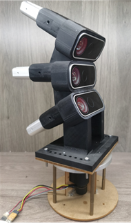

# real-dataset

The rotational collection device we use is as follows.

Therefore, for each camera, it only involves one degree of freedom rotational movement around the axis of rotation.

The data for the middle camera is located in the path `Dataxxx/mian`.

`motor.txt` represents the absolute angular information measured by the angle encoder on the motor at corresponding times. The prior rotation angle of the camera around the rotation axis can be calculated using timestamps.

The RGB image and depth map are stored in `/color` and `/depth`, respectively. The depth map has been aligned to the RGB image, and both have a resolution of 1280*720.

`TIMESTAMP.txt` represents the timestamp.

`calibration.txt` represents the intrinsic parameters of the camera. The four values in the text correspond to fx, fy, cx, and cy.

（As the alignment of RGB and depth images has been implemented, there is only one set of intrinsic parameters.）

The transformation relationship between the camera coordinate system and the rotation center of the camera is
$$
T = \left| {\begin{array}{*{20}{c}}
R&t\\
0&1
\end{array}} \right| = \left| {\begin{array}{*{20}{c}}
{{\rm{0}}{\rm{.999043}}}&{{\rm{ - 0}}{\rm{.0207401}}}&{{\rm{0}}{\rm{.0385098}}}&{{\rm{0}}{\rm{.0372677}}}\\
{{\rm{0}}{\rm{.0202488}}}&{{\rm{0}}{\rm{.999709}}}&{{\rm{0}}{\rm{.013104}}}&{{\rm{ - 3}}{\rm{.59057e - 06}}}\\
{{\rm{ - 0}}{\rm{.0387704}}}&{{\rm{ - 0}}{\rm{.0123117}}}&{{\rm{0}}{\rm{.999172}}}&{{\rm{ - 1}}{\rm{.09571e - 09}}}\\
0&0&0&1
\end{array}} \right|
$$
Where R represents the rotation matrix, and the unit of t is meters.

